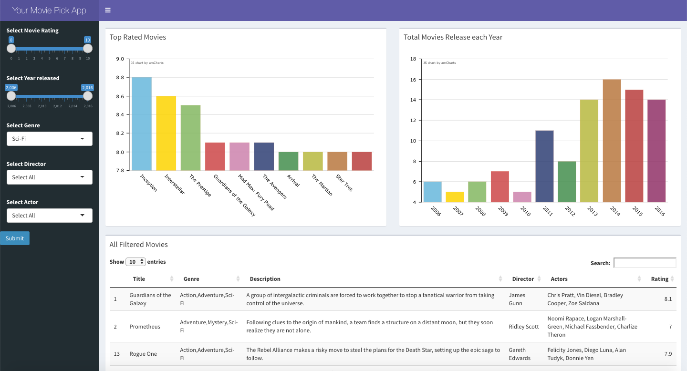
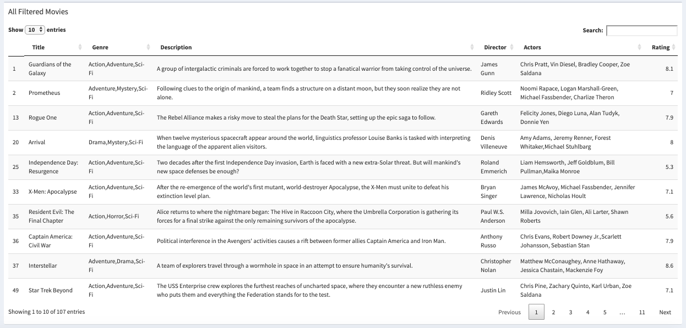

Course Project: Shiny Application and Reproducible Pitch
========================================================
author: Fezekile Mdluli
date: 22 January 2020
autosize: true

Background
========================================================

The main objective of this presentation is to present a Movie App developed in R Study using Shiny. 

The App allows a user to get detailed information on selected movies as well as do basic comparison between movies.

The app is hosted on the Shiny io server and can be accessed on this link https://fmdluli.shinyapps.io/movieSelection/


Data Description
========================================================

The Dataset consists of 838 most popular movies on IMDB over a 10 year period (2006 - 2016).The dataset used was downloaded from Kaggle-[https://www.kaggle.com/PromptCloudHQ/imdb-data/data]. 

The dataset has many attributes, but for the purpose of this movie comparison, we will be focussing the ones below,
- Rating of the Movie - User rating for the movie 0-10
- Year of Release
- Genre of the movie
- Director of the Movie
- Actor of the Movie

Exploratory Analysis
========================================================
Lets a snapshot of the variables as well as their attributes.


```
'data.frame':	838 obs. of  5 variables:
 $ Rank    : int  1 2 3 4 5 6 7 9 10 11 ...
 $ Title   : chr  "Guardians of the Galaxy" "Prometheus" "Split" "Sing" ...
 $ Genre   : chr  "Action,Adventure,Sci-Fi" "Adventure,Mystery,Sci-Fi" "Horror,Thriller" "Animation,Comedy,Family" ...
 $ Director: chr  "James Gunn" "Ridley Scott" "M. Night Shyamalan" "Christophe Lourdelet" ...
 $ Actors  : chr  "Chris Pratt, Vin Diesel, Bradley Cooper, Zoe Saldana" "Noomi Rapace, Logan Marshall-Green, Michael Fassbender, Charlize Theron" "James McAvoy, Anya Taylor-Joy, Haley Lu Richardson, Jessica Sula" "Matthew McConaughey,Reese Witherspoon, Seth MacFarlane, Scarlett Johansson" ...
```

App Demo
========================================================



The app is interactive and can be accessed on this link https://fmdluli.shinyapps.io/movieSelection/

Use Case
- What Sci-Fi movies were released between 2006 - 2016.
***


Results
- Top rated Movies Dashboard - This shows the top racted movies in the selected period, genre,director and/or actor.
- Total Movies Released each Year Dashboard - This shows the total number of movies released over the 10 year period.
- All Filtered Movies - Shows the list of the movies in the selected period, genre,director and/or actor.
